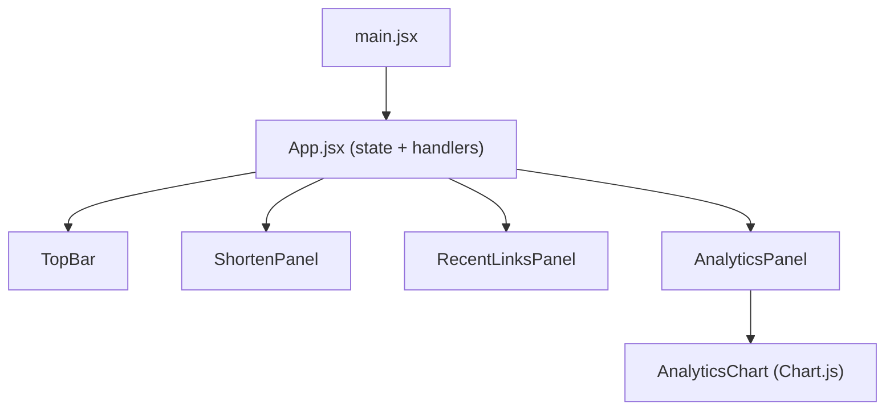
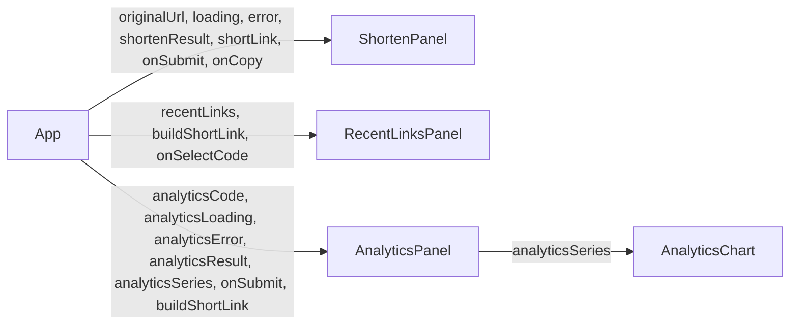
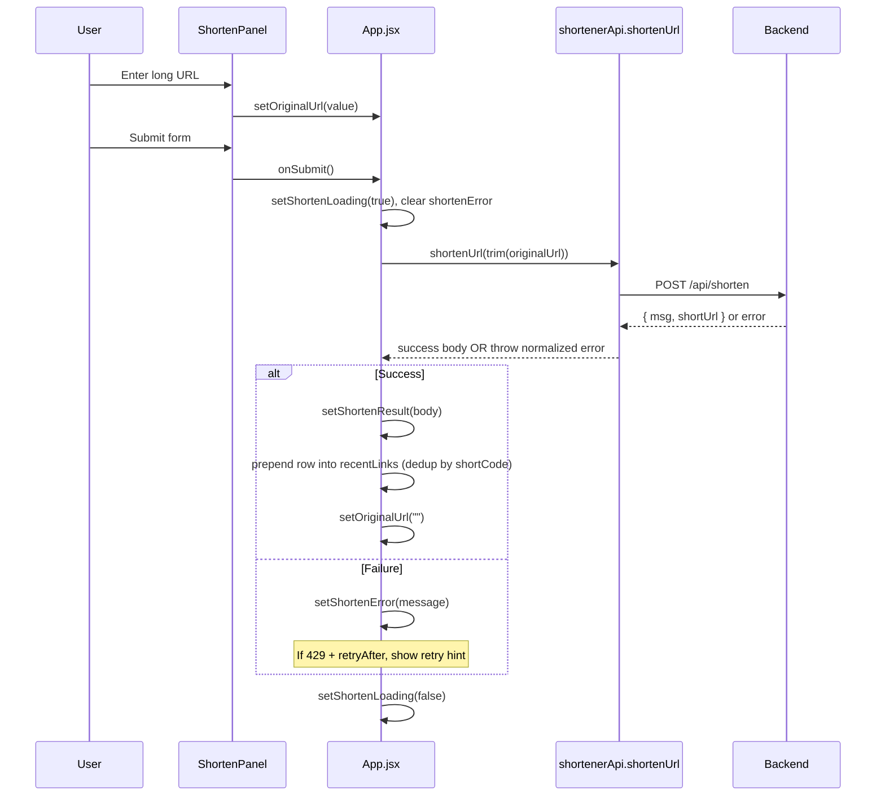
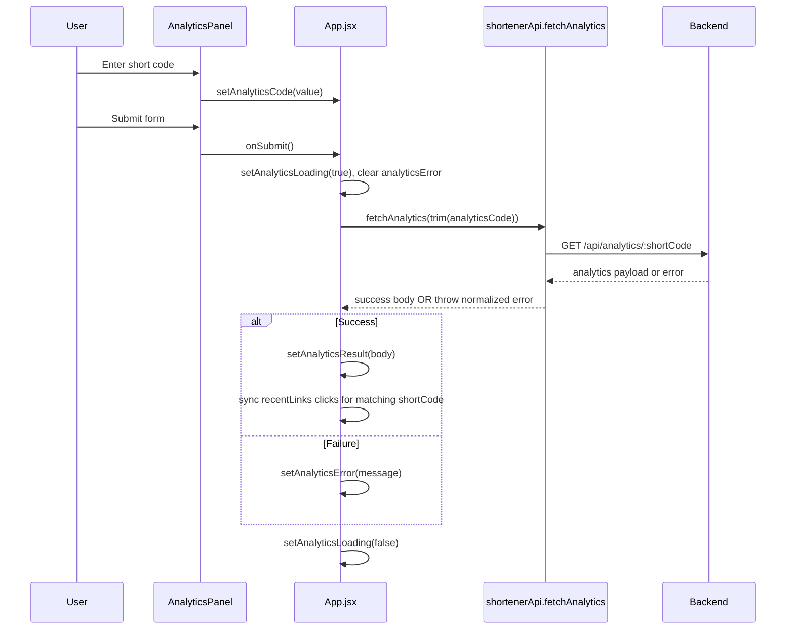
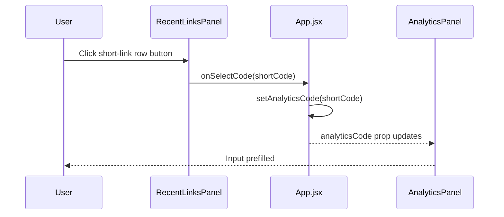

# Frontend Data Flow Guide

This document explains how data moves through your frontend:
- from user actions,
- through React state and props,
- into API calls,
- back into UI rendering.

It is written for your current structure:
- `src/main.jsx`
- `src/App.jsx`
- `src/services/shortenerApi.js`
- `src/components/dashboard/*`

---

## 1) Architecture at a Glance

Your frontend follows a clean pattern:

- **`App.jsx` = container/orchestrator**
  - owns page-level state
  - defines async handlers
  - computes derived values
  - passes data and handlers into child components

- **Dashboard components = presentational sections**
  - `ShortenPanel`, `RecentLinksPanel`, `AnalyticsPanel`
  - receive props and emit events up

- **`shortenerApi.js` = API boundary**
  - all HTTP details and error shaping are centralized

- **`AnalyticsChart.jsx` = imperative integration boundary**
  - encapsulates Chart.js lifecycle (`create/destroy`) behind a declarative prop API

---

## 2) Component Tree and Ownership

### Ownership rules

- `App.jsx` owns all business state.
- Child components do **not** own business data; they render what they receive.
- Child components notify `App.jsx` through callbacks (props like `onSubmit`, `onSelectCode`).

---

## 3) State Model (`App.jsx`)

### Shorten flow state

- `originalUrl`: controlled text in shorten input.
- `shortenLoading`: submit button loading/disable.
- `shortenError`: user-visible error string for shorten operation.
- `shortenResult`: latest successful shorten response payload.

### Analytics flow state

- `analyticsCode`: controlled text in analytics input.
- `analyticsLoading`: loading/disable for analytics fetch.
- `analyticsError`: user-visible analytics error.
- `analyticsResult`: successful analytics payload.

### Supporting state

- `recentLinks`: session-local list for "Recent Links" table.

### Derived state (memoized)

- `shortLink`: full URL generated from `shortenResult.shortUrl`.
- `analyticsSeries`: 7-day placeholder distribution generated from `analyticsResult.totalClicks`.

---

## 4) Prop Flow (Downstream)

### Why this is good

- Simple one-way data flow.
- Easy debugging: all source-of-truth is in `App`.
- Easy refactor path later (you can migrate to context/store only if needed).

---

## 5) Event Flow (Upstream)

User interactions bubble up through callback props:

- `ShortenPanel form submit` -> `App.handleShortenSubmit`
- `ShortenPanel copy button` -> `App.handleCopy`
- `RecentLinksPanel row button` -> `App.setAnalyticsCode`
- `AnalyticsPanel form submit` -> `App.handleAnalyticsSubmit`

So children remain thin; parent executes side effects.

---

## 6) API Boundary and Contracts

All network requests go through `src/services/shortenerApi.js`.

## `shortenUrl(originalUrl)`

- **Request**
  - `POST /api/shorten`
  - body: `{ originalUrl: string }`

- **Success response (current backend shape)**
  - `{ msg: string, shortUrl: string }`

- **Failure behavior**
  - Throws normalized object:
    - `status`
    - `message`
    - `retryAfter` (number | null)

## `fetchAnalytics(shortCode)`

- **Request**
  - `GET /api/analytics/:shortCode`

- **Success response (current backend shape)**
  - `{ msg, shortCode, originalUrl, createdAt, totalClicks }`

- **Failure behavior**
  - Throws same normalized error object.

## `buildShortLink(shortCode)`

- Converts shortcode into full link using `VITE_API_BASE_URL` fallback.
- Prevents double slash via `replace(/\/$/, "")`.

---

## 7) Sequence: Shorten URL

### State transitions (shorten)

- Idle -> Loading -> Success/Failure -> Idle
- Side effect on success: `recentLinks` may grow/update.

---

## 8) Sequence: Fetch Analytics

### State transitions (analytics)

- Idle -> Loading -> Success/Failure -> Idle
- Side effect on success: specific `recentLinks` row click count is refreshed.

---

## 9) Sequence: Row Click -> Prefill Analytics

This is a local UI-only state update (no network call yet).

---

## 10) Chart Data Flow (`AnalyticsChart.jsx`)

Chart component receives `analyticsSeries` from parent:

1. `App` computes `analyticsSeries` from `analyticsResult.totalClicks`.
2. `AnalyticsPanel` passes it down.
3. `AnalyticsChart` effect runs on series change.
4. Old chart instance destroyed.
5. New chart instance created with updated data.
6. On unmount/re-render cleanup runs to avoid memory leaks.

### Why this pattern matters

- Chart.js is imperative, React is declarative.
- This component cleanly isolates imperative lifecycle code.

---

## 11) Error Flow

Error normalization occurs in `shortenerApi.js`, not in each component:

- API layer converts response into stable error shape.
- `App` decides user-facing message.
- Panels only render strings passed by `App`.

### Rate-limit behavior

- On `429`, API layer includes `retryAfter`.
- `App` augments message: `"Retry in Xs."`
- `ShortenPanel` displays message below input.

---

## 12) Environment Flow

- `API_BASE` uses:
  - `import.meta.env.VITE_API_BASE_URL` if provided
  - fallback: `http://localhost:3000`

This lets same frontend code work across:
- local dev
- staging
- production (via env replacement at build/runtime config stage)

---

## 13) Current Data Limitations (Important)

Some dashboard data is currently placeholder-driven because backend endpoint scope is limited:

- `analyticsSeries` is generated from a static ratio pattern, not true day buckets.
- "Top Referrer" and "Top Device" show `N/A`.
- "Recent Links" is client session-local state, not server-persisted list.

This means a refresh clears recent links and chart bars are synthetic.

---

## 14) Suggested Next Dataflow Upgrades

If you expand backend, your frontend can become fully real with minimal structural change.

### Suggested backend additions

1. `GET /api/links?limit=...`
   - returns recent links with click counts/status
2. `GET /api/analytics/:shortCode/timeseries?days=7`
   - returns true daily clicks
3. `GET /api/analytics/:shortCode/breakdown`
   - returns referrer/device breakdown

### Frontend changes needed

- Replace `generateSevenDaySeries(...)` with real timeseries response.
- Hydrate `recentLinks` from API on app load.
- Replace `N/A` cards with real breakdown values.

Your component boundaries are already suitable for these upgrades.

---

## 15) Quick Mental Model

If you remember only one thing, remember this:

**`App` owns state + effects, children render + emit events, services talk to backend, chart component isolates imperative drawing.**

That is the core dataflow contract of your frontend.
